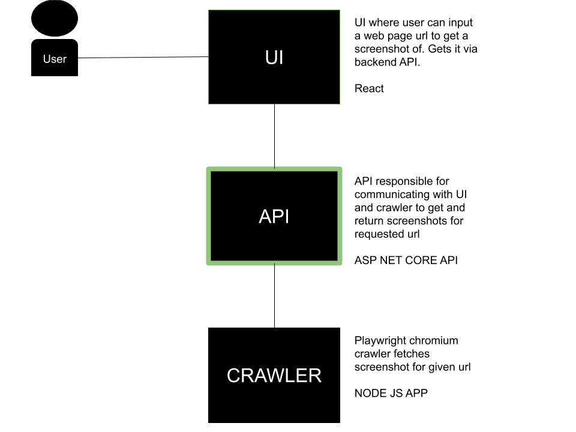

# demo-crawler-api
Rest API to initiate web page crawl and fetch related data

## Building, tagging and deploy docker image

### Build
`docker build -t demo-crawler-api .`

### Tag
`docker tag demo-crawler-api registry.heroku.com/demo-crawler-api/web`

### Heroku deployment
``` 
    heroku login
    heroku container:login

    heroku container:push web -a demo-crawler-api

    heroku container:release web -a demo-crawler-api
```

### Visit heroku app
[https://demo-crawler-api.herokuapp.com/](https://demo-crawler-api.herokuapp.com/)


## Architecture
This react app makes up the API for the "demo crawler" app which is structured as:

